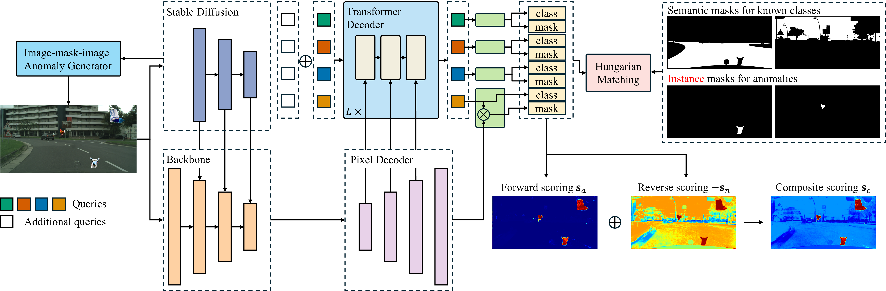

# P2A: Transforming Proposals to Anomaly Masks (ICPR 2024)
> 
> Authors:
> Huachao Zhu, 
> [Zhichao Sun](https://sunzc-sunny.github.io/),
> Zelong Liu,
> [Yongchao Xu](https://cs.whu.edu.cn/info/1019/2496.htm), 
>

<p align="center">
     <br />
    <em> 
    Figure 1: Qualitative comparison on ACDC. The yellow box represents the densely partitioned VP region. Our model produces more accurate results for both distant tiny hard samples near the VP and occluded fast-moving close targets.
    </em>
</p>

## Installation
Please refer to [get_started.md](docs/en/get_started.md#installation) for installation. 

Here is an example:
```bash
conda create -n p2a python=3.9
conda activate p2a
conda install pytorch==2.1.2 torchvision==0.16.2 torchaudio==2.1.2 pytorch-cuda=11.8 -c pytorch -c nvidia
pip install -U openmim
mim install mmengine
mim install "mmcv>=2.0.0"
mim install mmdet
pip install -v -e .
```


### Datasets
 
* **Cityscapes:** consists of inlier classes.
* **MS COCO:** helps fine-tune the model on ood-objects. 
* **Road Anomaly Datasets:** _RoadAnomaly_ can be downloaded at [link](https://www.epfl.ch/labs/cvlab/data/road-anomaly/). _FS Static validation_ can be downloaded according to [Mask2Anomaly](https://github.com/phatli/Mask2Anomaly). _SMIYC RoadAnomaly21_ can be downloaded at [link](https://segmentmeifyoucan.com/datasets). 


## Quantitative Results
The results for various methods on _Road Anomaly_, _FS L&F_ and _FS Static_ are shown as below.

| Methods         | Road Anomaly AUC ↑ | Road Anomaly AP ↑ | Road Anomaly FPR95 ↓ | FS L&F AUC ↑ | FS L&F AP ↑ | FS L&F FPR95 ↓ | FS Static AUC ↑ | FS Static AP ↑ | FS Static FPR95 ↓ |
|-----------------|---------------------|-------------------|-----------------------|--------------|-------------|----------------|-----------------|----------------|--------------------|
| SynthCP         | 88.34               | 6.54              | 45.95                 | 89.90        | 23.22       | 34.02          | 76.08           | 24.86          | 64.69              |
| SML             | 81.96               | 25.82             | 49.74                 | 96.88        | 36.55       | 14.53          | 96.69           | 48.67          | 16.75              |
| Meta-OoD        | -                   | -                 | -                     | 93.06        | 41.31       | 37.69          | 97.56           | 72.91          | 13.57              |
| SynBoost-WR38   | 81.91               | 38.21             | 64.75                 | 96.21        | 60.58       | 31.02          | 95.87           | 66.44          | 25.59              |
| MOoSe           | -                   | 43.59             | 32.12                 | -            | -           | -              | -               | -              | -                  |
| PEBAL           | 87.63               | 45.10             | 44.58                 | 98.96        | 58.81       | 4.76           | 99.61           | 92.08          | 1.52               |
| ATTA            | 92.11               | 59.05             | 33.59                 | 99.05        | 65.58       | 4.48           | **99.66**           | 93.61          | 1.15               |
| Mask2Anomaly    | 96.57               | 79.70             | 13.45                 | 95.41        | 69.46       | 9.31           | 98.35           | 90.54          | 1.98               |
| RbA             | 97.99               | 85.42             | 6.92                  | 98.62        | 70.81       | 6.30           | 98.96           | 75.43          | 3.52               |
| cDNP            | -                   | 85.6              | 9.8                   | -            | -           | -              | -               | -              | -                  |
| P2A (ours)      | **98.40**               | **89.42**             | **5.95**                  | 97.24        | 65.15       | 13.98          | **99.66**           | **96.93**          | **0.11**               |


The results for various methods on _SMIFC RoadAnomaly21_ are shown as below.

| Methods                | AP ↑      | FPR95 ↓ | SIoU gt ↑ | PPV ↑    | mean F1 ↑ |
|------------------------|-----------|---------|-----------|---------|-----------|
| Image Resynthesis      | 52.28     | 25.93   | 39.68     | 10.95   | 12.51     |
| SML                    | 46.8      | 39.5    | 26.0      | 24.7    | 12.2      |
| SynBoost               | 56.44     | 61.86   | 34.68     | 17.81   | 9.99      |
| Void Classifier        | 36.61     | 63.49   | 21.14     | 22.13   | 6.49      |
| DenseHybrid            | 77.96     | 9.81    | 54.17     | 24.13   | 31.08     |
| PEBAL                  | 49.14     | 40.82   | 38.88     | 27.20   | 14.48     |
| Mask2Anomaly           | 88.72     | 14.63   | 55.28     | 51.68   | 47.16     |
| RbA                    | 90.9      | 11.6    | **55.7**      | 52.1    | 46.8      |
| cDNP                   | 88.90     | 11.42   | 50.44     | 29.04   | 28.12     |
| ATTA                   | 67.04     | 31.57   | 44.58     | 29.55   | 20.64     |
| NFlowJS                | 56.92     | 34.71   | 36.94     | 18.01   | 14.89     |
| P2A (ours)             | **91.5**      | **8.9**     | 55.5      | **52.2**    | **53.4**      |

## Acknowledgement
We use some codes from repositories including [ControlNet](https://github.com/lllyasviel/ControlNet), [Meta-OOD](https://github.com/robin-chan/meta-ood) and [Mask2Anomaly](https://github.com/shyam671/Mask2Anomaly-Unmasking-Anomalies-in-Road-Scene-Segmentation). We build our codes on [mmsegmentation](https://github.com/open-mmlab/mmsegmentation).